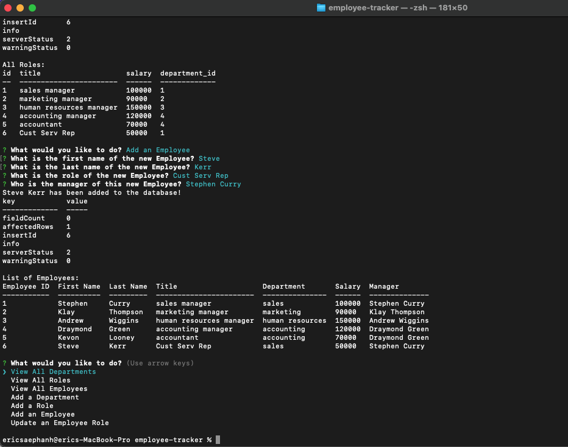

# employee-tracker

## Description

Application to help a business owner view and manage the departments, roles, and employees in their company

## Installation

Clone github repo. Install Inquirer and Node. 

## Usage

Initiate MySQL in the command line and enter your password. Source the schema.sql and then seeds.sql to generate the employees database and tables. Then enter npm start and the prompt questions will display for the user to scroll up and down to the task they want. 

## License
ISC

## Links

Github Repo: https://github.com/saephanhe56/employee-tracker
Video Link: https://drive.google.com/file/d/1-xULl7CN1wQKbCdlyyoDMBk8UL-Z94-Z/view

## Mockup Example Product 

